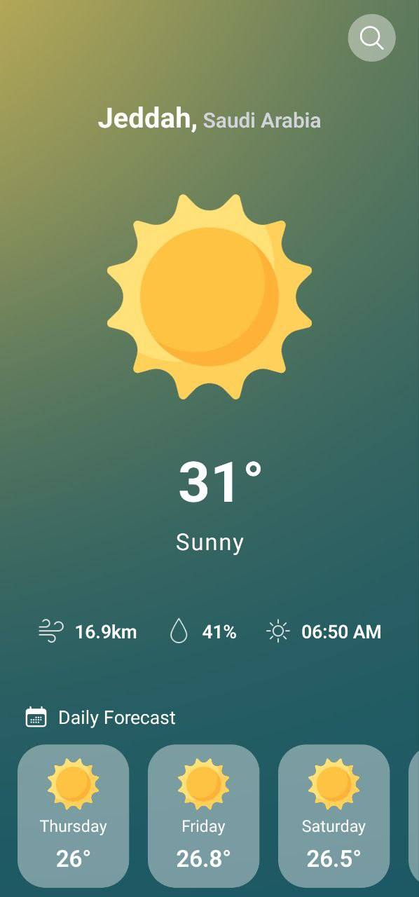
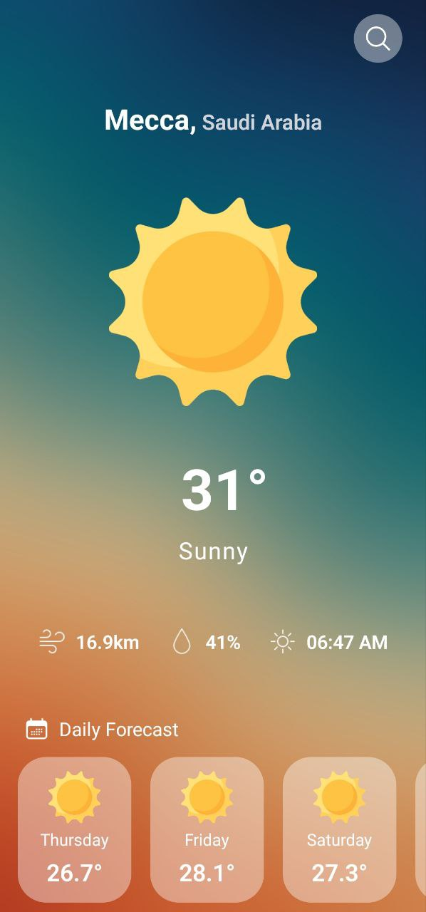
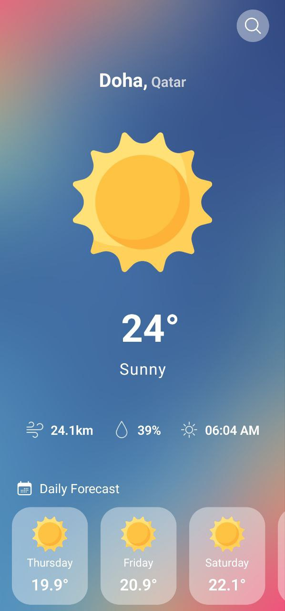
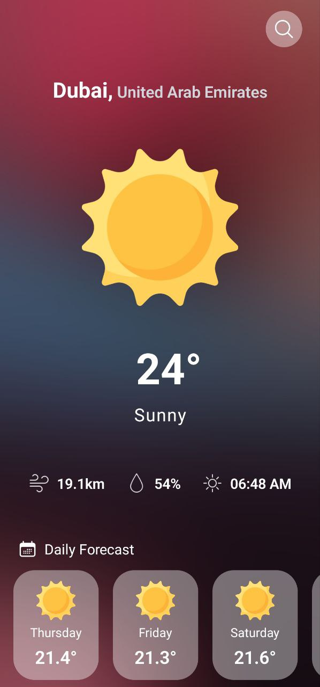

# Weather App React Native


## What did we use in the project?
### 1- [React Native Expo](https://reactnative.dev/)
### 2- [NativeWind](https://www.nativewind.dev/)
### 3- [React Navigation](https://reactnavigation.org/)
### 4- [React Native heroicons](https://www.npmjs.com/package/react-native-heroicons)
### 5- [Weather API](https://www.weatherapi.com/)
### 6- [React Native Axios](https://www.npmjs.com/package/react-native-axios)

## Packages
- npx create-expo-app Weather-App-Ui
- npm i nativewind
- npm i --dev tailwindcss@3.3.2
- npx tailwindcss init
- npm install @react-navigation/native
- npx expo install react-native-screens react-native-safe-area-context
- npm install @react-navigation/native-stack
- npm i react-native-responsive-screen
- npm i react-native-heroicons
- npm i react-native-heroicons react-native-svg
- npm install axios => React Js
- npm i react-native-axios => React Native
- npm i react-native-progress
- npm i @react-native-async-storage/async-storage
```
// tailwind.config.js
module.exports = {
- content: [],
+ content: ["./App.{js,jsx,ts,tsx}", "./<custom directory>/**/*.{js,jsx,ts,tsx}"],
  theme: {
    extend: {},
  },
  plugins: [],
}

  content: [
    "./App.{js,jsx,ts,tsx}", 
    "./screens/**/*.{js,jsx,ts,tsx}",
    "./components/**/*.{js,jsx,ts,tsx}"
  ],

3. Add the Babel plugin

Modify your babel.config.js

// babel.config.js
module.exports = function (api) {
  api.cache(true);
  return {
    presets: ["babel-preset-expo"],
+   plugins: ["nativewind/babel"],
  };
};
```
## Preview Final Project

#### Home Screen

 
 


## Run The Project
- Download
- Open The Project
- Terminal
- npm i
- npx expo
- -w or Open Expo App On your Phone
- npx expo install --fix
- npx expo install
- expo install --fix
